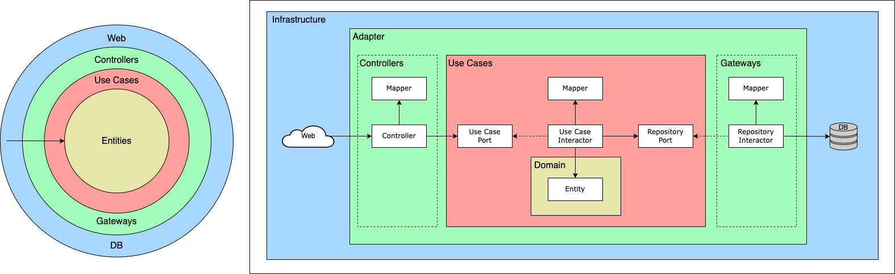

# Boilerplate Clean Architecture

This is a boilerplate for Clean Architecture.

#### Table of contents

- [Architecture](#Architecture)
- [Development](#Development)

## Technology Stack

| Category              | Technology Stack                   |
| --------------------- | ---------------------------------- |
| Programming Languages | Go                                 |
| Frameworks/Libraries  | OpenAPI, chi, wire, bun, go-migrate |
| Environment setup     | Docker                             |


# Architecture



```
.
├── adapter
│   ├── controller
│   │   ├── user_handler.go
│   │   └── user_handler_mapper.go
│   └── gateway
│       ├── user_repository_impl.go
│       └── user_repository_mapper.go
├── domain
│   └── entity
│       └── user.go
├── infrastructure
│   └── db
│       └── xxx.go
└── usecase
    ├── user_repository_port.go
    ├── user_usecase_impl.go
    ├── user_usecase_mapper.go
    └── user_usecase_port.go
```

## Infrastructure

フレームワークやデータベースに依存する実装を担当する。  
データベース接続やマイグレーション、REST API の仕様定義など。

## Adapter

Web API やデータベースなど外部とのやり取りを担当する。  
外部フォーマット ⇔ 上位レイヤーフォーマットの変換もこのレイヤーで行う。

外部とのやり取り・仕様に関する詳細を本レイヤーに隠蔽し、外部仕様変更に伴う上位レイヤーへの影響を最小限にする事が責務。  
本アーキテクチャでは、Controller が Web API とのやり取りを担当し、Gateway がデータベースとのやり取りを担当する。

### Controller

Web API とのやり取りを担当する。  
リクエストデータを Use Case で扱うフォーマットに変換の上、Use Case レイヤーに連携する。レスポンスでは、Use Case レイヤーの出力データを Web API フォーマットに変換して返却する。  
Use Case レイヤーとの連携は、Use Case Port （インターフェース）を介して行う。

```go
// user_handler.go

func (h *UserHandler) AddUser(w http.ResponseWriter, r *http.Request) {
	req, err := ToDTO(r.Body) // Web API フォーマットから Use Case フォーマットへの変換
	if err != nil {
		HttpError(w, err)
		return
	}

	result, err := h.usecase.AddUser(r.Context(), req)
	if err != nil {
		HttpError(w, err)
		return
	}

	h.HandleOK(w, FromDTO(result)) // Use Case フォーマットから Web API フォーマットへの変換
}
```

Web API フォーマットと Use Case フォーマットの変換は、Controller Mapper を参照する。

### Controller Mapper

Web API フォーマットと Use Case フォーマットの変換を行う。  
アプリケーションエラーから HTTP エラーへの変換も行う。（詳細は [Error Strategy](#error-strategy) を参照）

```go
// user_handler_mapper.go

// リクエストを Use Case フォーマットに変換
func ToDTO(
	body io.ReadCloser,
) (*usecase.User, *pkgErr.ApplicationError) {
	var dto usecase.User
	if err := json.NewDecoder(body).Decode(&dto); err != nil {
		return nil, pkgErr.NewApplicationError(err.Error(), pkgErr.LevelWarn, pkgErr.CodeBadRequest)
	}
	return &usecase.User{
		ID:        dto.ID,
		FirstName: dto.FirstName,
		LastName:  dto.LastName,
		Age:       dto.Age,
	}, nil
}

// Use Case フォーマットを API レスポンスに変換
func FromDTO(
	dto *usecase.User,
) *User {
	return &User{
		Id:        dto.ID,
		FirstName: dto.FirstName,
		LastName:  dto.LastName,
		Age:       int(dto.Age),
	}
}
```

### Gateway

データベースとのやり取りを担当する。Repository Port（インターフェース）の実装。  
Use Case レイヤーから連携された Entity を ORM モデルに変換し、データベースとのやり取りを行う。反対に、Use Case レイヤーへの返却時は、ORM モデルを Entity に変換して返却する。

```go
// user_repository_impl.go

func (u *UserRepositoryImpl) Save(ctx context.Context, entity *entity.User) (*entity.User, *pkgErr.ApplicationError) {
	tx := ctx.Value(TX_KEY).(*bun.Tx)

	user := FromEntity(entity) // Entity を ORM モデルに変換
	if _, err := tx.NewInsert().Model(user).Exec(ctx); err != nil {
		return nil, RepositoryError(err)
	}
	return user.ToEntity(), nil // ORM モデルを Entity に変換
}
```

ORM モデルと Entity の変換は、Gateway Mapper を参照する。

### Gateway Mapper

ORM モデルと Entity の変換を行う。  
データベースエラーからアプリケーションエラーへの変換も行う。（詳細は [Error Strategy](#error-strategy) を参照）

```go
// user_repository_mapper.go

// ORM モデル
type User struct {
	ID        string    `bun:"id,pk,type:uuid,default:gen_random_uuid()"`
	FirstName string    `bun:"first_name,notnull"`
	LastName  string    `bun:"last_name,notnull"`
	Age       int32     `bun:"age,notnull"`
	CreatedAt time.Time `bun:"created_at,nullzero,notnull,default:current_timestamp"`
	UpdatedAt time.Time `bun:"updated_at,nullzero,notnull,default:current_timestamp"`
}


// ORM モデルを Entity に変換
func (u *User) ToEntity() *entity.User {
	return &entity.User{
		ID:        u.ID,
		FirstName: u.FirstName,
		LastName:  u.LastName,
		Age:       u.Age,
		CreatedAt: u.CreatedAt,
		UpdatedAt: u.UpdatedAt,
	}
}


// Entity を ORM モデルに変換
func FromEntity(
	entity *entity.User,
) *User {
	return &User{
		ID:        entity.ID,
		FirstName: entity.FirstName,
		LastName:  entity.LastName,
		Age:       entity.Age,
		CreatedAt: entity.CreatedAt,
		UpdatedAt: entity.UpdatedAt,
	}
}
```

## Use Case

ビジネスロジック（ソフトウェアで何が出来るかの表現）を担当する。Use Case Port（インターフェース）の実装。  
Use Case フォーマットから Entity への変換を行い、Repository に渡す。Repository との連携は、Repository Port を介して行う。

```go
// user_usecase_port.go

type UserUsecase interface {
	AddUser(ctx context.Context, dto *User) (*User, *pkgErr.ApplicationError)
}
```

```go
// user_usecase_impl.go

func (u *UserUsecaseImpl) AddUser(
	ctx context.Context,
	dto *User,
) (*User, *pkgErr.ApplicationError) {
	entity, err := u.userRepository.Save(ctx, dto.ToEntity()) // Use Case フォーマットを Entity に変換
	if err != nil {
		return nil, err
	}
	return FromEntity(entity), nil // Entity を Use Case フォーマットに変換
}
```

Use Case フォーマットと Entity の変換は、Use Case Mapper を参照する。

### Use Case Mapper

Use Case Data Structure と Entity の変換を行う。

```go
// user_usecase_mapper.go

// Use Case Data Structure
type User struct {
	ID        string
	FirstName string
	LastName  string
	Age       int32
}

// Use Case フォーマットを Entity に変換
func (u *User) ToEntity() *entity.User {
	return &entity.User{
		FirstName: u.FirstName,
		LastName:  u.LastName,
		Age:       u.Age,
	}
}

// Entity を Use Case フォーマットに変換
func FromEntity(
	entity *entity.User,
) *User {
	return &User{
		ID:        entity.ID,
		FirstName: entity.FirstName,
		LastName:  entity.LastName,
		Age:       entity.Age,
	}
}
```

存方向を下位レイヤー → 上位レイヤーに限定する必要があるため、Repository Port は （Gateway 側ではなく）Use Case 側に定義。

```go
// user_repository_port.go

type UserRepository interface {
	Save(ctx context.Context, e *entity.User) (*entity.User, *pkgErr.ApplicationError)
}
```

## Domain

ビジネスルールを表現し、どのレイヤーにも依存しないソフトウェアの中核となる部分。

### Entity

```go
// entity/user.go

// Entity
type User struct {
	ID        string
	FirstName string
	LastName  string
	Age       int32
	CreatedAt time.Time
	UpdatedAt time.Time
}
```

# Error Strategy

アプリケーション独自のカスタムエラーを定義。外部エラーをカスタムエラーにマッピングすることで、外部技術の詳細を隠蔽する方針。
メッセージ、レベル、コードの 3 要素で構成され、レベルとコードによってエラーの重要度を表現し、よしなにハンドリングする。

本アーキテクチャでは、データベースエラーをカスタムエラーに変換し、上位レイヤーへの詳細の流入を防いだり、カスタムエラーを HTTP エラーに変換し、適切なレスポンスを返却する用途で利用する。

```go
// Custom Error

type ErrorLevel int8

const (
	_ ErrorLevel = iota
	LevelInfo
	LevelWarn
	LevelError
)

type ErrorCode int

const (
	_ ErrorCode = iota
	CodeBadRequest
	CodeNotFound
	CodeDuplicate
	CodeInternalServerError
)

type ApplicationError struct {
	message string
	level   ErrorLevel
	code    ErrorCode
}

func (e *ApplicationError) Error() string {
	return e.message
}

func (e *ApplicationError) Level() ErrorLevel {
	return e.level
}

func (e *ApplicationError) Code() ErrorCode {
	return e.code
}

func NewApplicationError(message string, level ErrorLevel, code ErrorCode) *ApplicationError {
	return &ApplicationError{
		message: message,
		level:   level,
		code:    code,
	}
}

```

## Database Error Mapping

```go
// user_repository_mapper.go

func RepositoryError(err error) *pkgErr.ApplicationError {
	switch err {
	case sql.ErrNoRows:
		return pkgErr.NewApplicationError(err.Error(), pkgErr.LevelWarn, pkgErr.CodeNotFound)
	default:
		return pkgErr.NewApplicationError(err.Error(), pkgErr.LevelError, pkgErr.CodeInternalServerError)
	}
}
```

### Usage

```go
// user_repository_impl.go

func (u *UserRepositoryImpl) Save(ctx context.Context, entity *entity.User) (*entity.User, *pkgErr.ApplicationError) {
	tx := ctx.Value(TX_KEY).(*bun.Tx)

	user := FromEntity(entity)
	if _, err := tx.NewInsert().Model(user).Exec(ctx); err != nil {
		return nil, RepositoryError(err) // データベースエラーをカスタムエラーに変換
	}
	return user.ToEntity(), nil
}
```

## HTTP Error Mapping

```go
// user_handler_mapper.go

func NotFoundError(w http.ResponseWriter, err *pkgErr.ApplicationError) {
	setHeaderContentType(w)
	w.WriteHeader(http.StatusNotFound)
	json.NewEncoder(w).Encode(Error{
		Code:    http.StatusNotFound,
		Message: err.Error(),
	})
}

func InternalServerError(w http.ResponseWriter, err *pkgErr.ApplicationError) {
	setHeaderContentType(w)
	w.WriteHeader(http.StatusInternalServerError)
	json.NewEncoder(w).Encode(Error{
		Code:    http.StatusInternalServerError,
		Message: err.Error(),
	})
}

func HttpError(w http.ResponseWriter, err *pkgErr.ApplicationError) {
	switch err.Code() {
	case pkgErr.CodeNotFound:
		NotFoundError(w, err)
	default:
		InternalServerError(w, err)
	}
}
```

### Usage

```go
// user_handler.go

func (h *UserHandler) AddUser(w http.ResponseWriter, r *http.Request) {
	req, err := ToDTO(r.Body)
	if err != nil {
		HttpError(w, err) // カスタムエラーを HTTP エラーに変換
		return
	}

	result, err := h.usecase.AddUser(r.Context(), req)
	if err != nil {
		HttpError(w, err) // カスタムエラーを HTTP エラーに変換
		return
	}

	h.HandleOK(w, FromDTO(result))
}
```

# Development

## Get Started

Run the following command. Server will start on http://localhost:8080.

```bash
$ make run
```

## How To Use

### Add user

```bash
$ curl --location 'http://localhost:8080/users' \
  --header 'Content-Type: application/json' \
  --header 'Accept: application/json' \
  --data '{
    "firstName": "test",
    "lastName": "user",
    "age": 20
  }'
```

```json
{
  "age": 20,
  "firstName": "test",
  "id": "<USER_ID>",
  "lastName": "user"
}
```

### Find user

```bash
$ curl --location 'http://localhost:8080/users/<USER_ID>'
```

```json
{
  "age": 20,
  "firstName": "test",
  "id": "<USER_ID>",
  "lastName": "user"
}
```

## How To Development

### API Schema

You need to update `api/openapi.yaml` and run the following command to update OpenAPI schema.

```bash
$ make openapi-gen
```

Generated files are `internal/infrastructure/openapi/model.gen.go` and `internal/infrastructure/openapi/server.gen.go`.

### Dependency Injection

You need to run the following command to update dependency injection.

```bash
$ make wire-gen
```

### Migration

You need to run the following commands to update migration.

```bash
# generate
$ make migrate-create name=<NAME>

# up
$ make migrate-up

# down
$ make migrate-down
```

### Test

#### E2E Test

To run E2E test, you need to run the following commands or GitHub Actions Workflow.

```bash
# e2e container up and migration up
$ make e2e-up

# e2e run
$ make e2e-run
```

# References

- [Standard Go Project Layout](https://github.com/golang-standards/project-layout/tree/master)
- [Clean Architecture](https://blog.cleancoder.com/uncle-bob/2012/08/13/the-clean-architecture.html)
- [Clean Architecture 達人に学ぶソフトウェアの構造と設計](https://www.amazon.co.jp/Clean-Architecture-%E9%81%94%E4%BA%BA%E3%81%AB%E5%AD%A6%E3%81%B6%E3%82%BD%E3%83%95%E3%83%88%E3%82%A6%E3%82%A7%E3%82%A2%E3%81%AE%E6%A7%8B%E9%80%A0%E3%81%A8%E8%A8%AD%E8%A8%88-Robert-C-Martin/dp/4048930656)
